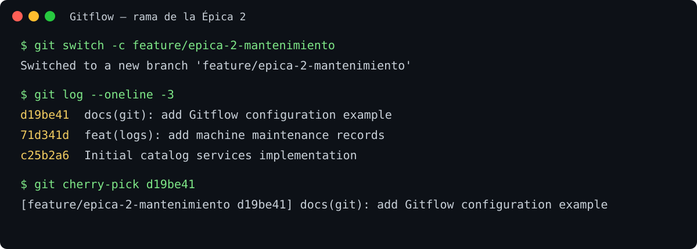
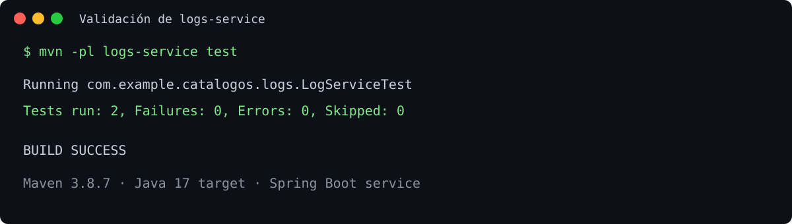

# Catálogos Backend

## Práctica Gitflow: Épica 2 — mantenimiento de maquinaria

Esta práctica implementa la segunda épica: registrar órdenes de mantenimiento y consultar su historial por número de serie o por turno actual. La funcionalidad está en `logs-service` y no usa anotaciones `@Transactional`, conforme al alcance de consultas e inserciones sin transacciones.

### Funcionalidad entregada

Cada orden registra `machineSerial`, `equipment`, `description`, `technician` y `maintenanceDate`. La fecha es opcional en la petición: si no se envía, el servidor usa la fecha actual.

| Operación | Endpoint |
|---|---|
| Registrar orden completada | `POST /api/logs` |
| Consultar todas las órdenes | `GET /api/logs` |
| Consultar por serie | `GET /api/logs/machine/{serialNumber}` |
| Consultar turno actual (fecha actual) | `GET /api/logs/current-shift` |
| Consultar, actualizar o eliminar por ID | `GET`, `PUT`, `DELETE /api/logs/{id}` |

Ejemplo de alta:

```json
{
  "machineSerial": "MX-101",
  "equipment": "Torno CNC",
  "description": "Cambio de banda",
  "technician": "María López",
  "maintenanceDate": "2026-10-02"
}
```

### Flujo Gitflow aplicado

La rama de integración es `develop`. Desde ella se creó `feature/epica-2-mantenimiento`; ahí se realizaron los cambios y las pruebas. Para demostrar la integración de un commit específico entre ramas, se creó `feature/epica-2-gitflow-evidence`, se confirmó el commit `docs(git): add Gitflow configuration example` y se incorporó en la rama de la épica con `git cherry-pick`.

```text
develop
  └── feature/epica-2-mantenimiento
        ├── feat(logs): add machine maintenance records
        └── cherry-pick: docs(git): add Gitflow configuration example

feature/epica-2-gitflow-evidence
  └── docs(git): add Gitflow configuration example
```

Los comandos previstos para publicar y fusionar en GitHub son:

```bash
git push -u origin feature/epica-2-mantenimiento
# Crear en GitHub el Pull Request feature/epica-2-mantenimiento -> develop
# Ejecutar el merge del Pull Request en GitHub y actualizar la rama local:
git switch develop
git pull --ff-only origin develop
```

El paso remoto quedó pendiente porque la credencial local `Josue1855` recibió `403 Permission denied` sobre el repositorio remoto `EdwinLedezma/DesarrolloWeb`. Por esa razón no se simuló ni se declaró realizada una fusión remota; es necesario que el propietario agregue esa cuenta como colaboradora, o iniciar sesión con una cuenta que tenga permisos de escritura. Además, la rama remota preexistente `feature` debe eliminarse antes de publicar `feature/epica-2-mantenimiento`, ya que Git no permite que una rama y un prefijo de ramas compartan ese nombre.

### Configuración Git

La identidad ya estaba configurada. La configuración recomendada para `~/.gitconfig` está versionada en [docs/gitconfig-gitflow.example](docs/gitconfig-gitflow.example): usa `main` como rama inicial, elimina referencias remotas obsoletas, crea seguimiento remoto automáticamente y conserva commits de merge. Para aplicarla manualmente:

```bash
git config --global init.defaultBranch main
git config --global fetch.prune true
git config --global pull.rebase false
git config --global push.autoSetupRemote true
git config --global merge.ff false
```

### Evidencia

La validación ejecutada fue `mvn -pl logs-service test`: 2 pruebas, 0 fallos y 0 errores.





Monorepo Maven con cuatro microservicios independientes en Java 17 y Spring Boot 3. Cada módulo puede ejecutarse por separado y utiliza su propia base de datos.

## Requisitos

- JDK 17 o superior
- Maven 3.9 o superior
- Docker Desktop con Docker Compose (para levantar PostgreSQL y MySQL localmente)

## Iniciar bases de datos

Desde la raíz del repositorio:

```powershell
docker compose up -d
```

El contenedor PostgreSQL crea `products_db`, `clients_db` y `logs_db`; MySQL crea `suppliers_db`. Las credenciales incluidas (`catalogos` / `catalogos_dev`) son únicamente valores locales de desarrollo. No reutilizarlas en producción.

## Compilar y probar

```powershell
mvn clean verify
```

## Ejecutar servicios

En terminales separadas, desde la raíz:

```powershell
mvn -pl products-service spring-boot:run
mvn -pl clients-service spring-boot:run
mvn -pl suppliers-service spring-boot:run
mvn -pl logs-service spring-boot:run
```

También se pueden empaquetar todos los módulos con `mvn clean package` y ejecutar el JAR de cada módulo. Puertos predeterminados: productos `8080`, clientes `8081`, proveedores `8082` y bitácoras `8083`.

Las conexiones aceptan variables de entorno `DB_URL`, `DB_USERNAME`, `DB_PASSWORD` y `SERVER_PORT`; revisa el `application.properties` de cada servicio para los valores predeterminados locales.

## Endpoints

| Servicio | Base URL | Operaciones |
|---|---|---|
| Productos | `http://localhost:8080/api/products` | GET, GET `/{id}`, POST, PUT `/{id}`, DELETE `/{id}`, GET `/search?name=texto` |
| Clientes | `http://localhost:8081/api/clients` | GET, GET `/{id}`, POST, PUT `/{id}`, DELETE `/{id}` |
| Proveedores | `http://localhost:8082/api/suppliers` | GET, GET `/{id}`, POST, PUT `/{id}`, DELETE `/{id}` |
| Bitácoras | `http://localhost:8083/api/logs` | GET, GET `/{id}`, POST, PUT `/{id}`, DELETE `/{id}` |

POST devuelve `201 Created`, DELETE `204 No Content`, las búsquedas inexistentes `404 Not Found` y las entradas inválidas `400 Bad Request`.

### Ejemplos JSON

Producto:

```json
{"name":"Teclado","description":"Mecánico","price":49.99,"stock":20}
```

Cliente:

```json
{"fullName":"Ana Pérez","email":"ana@example.com","phone":"555-0100"}
```

Proveedor:

```json
{"companyName":"Distribuidora Central","contactEmail":"ventas@example.com"}
```

Bitácora:

```json
{"message":"Se registró la operación"}
```

## Decisiones del backlog

- En productos se implementan `ProductRepository` y `TicketRepository` para cubrir los criterios de aceptación del backlog.
- En bitácoras se usa un ID `String` UUID, campo `message` y marca temporal generada/actualizada por el servidor.
- Los repositorios y servicios de clientes, proveedores y bitácoras se incluyeron para completar las capas CRUD solicitadas.
- Hibernate usa `ddl-auto=update` para facilitar desarrollo local. Para producción, reemplazarlo por migraciones versionadas y credenciales seguras.
